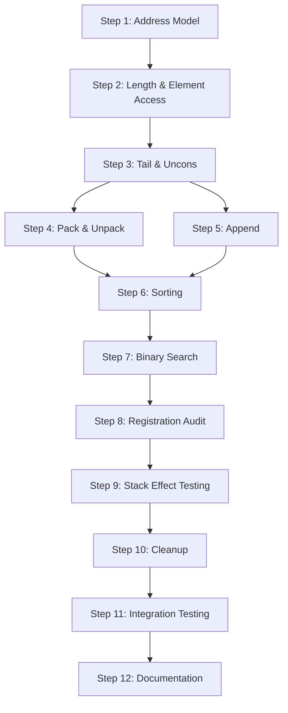

# Plan 06 — Lists Specification Alignment

Status: 🔄 **DRAFT**  
Owner: core  
Scope: Align current list implementation with docs/specs/lists.md specification  
Timebox: Iterative (each step individually reviewable). Tests MUST pass after every step.

---

## Executive Summary

While Plan 07 implemented comprehensive list functionality, analysis reveals significant gaps between the current implementation and the canonical lists.md specification. The current codebase has:

- **Missing Core Operations**: `length`, `elem`, `head`, `tail`, `uncons`, `pack`, `unpack`, `sort`, `bfind`, `fetch`, `store`
- **Non-compliant Stack Effects**: Some operations don't match spec stack effects
- **Missing Address Model**: No address-based access (`slot`, `elem`, `fetch`, `store`)
- **Missing Syntax**: List literals use `( )` but spec expects them registered properly
- **Incomplete Operation Set**: Many spec operations not implemented or registered

This plan provides a systematic approach to bring the implementation into **complete compliance** with lists.md.

---

## 0. Analysis Summary

### Currently Implemented ✅
```typescript
// Core infrastructure (src/core/list.ts)
- createList()
- getListSlotCount() 
- skipList()
- validateListHeader()
- getListElementAddress()
- reverseSpan()

// Operations (src/ops/builtins-list.ts)  
- openListOp/closeListOp   // ( — ) / ( values... — list )
- listSlotOp              // ( list — list n ) [as "slots"]
- consOp                  // ( list value — list' ) [as "cons"]  
- concatOp                // ( listA listB — listC ) [as "concat"]
- dropHeadOp             // ( list — list' ) [as "drop-head"]
- listGetAtOp/listSetAtOp // Internal operations, not spec-compliant

// Parsing
- '(' and ')' compile to OpenList/CloseList ops
```

### Missing from Specification ❌

**Core Operations** (per lists.md §9-§12):
```tacit
length   ( list — n )           # Element count via traversal  
elem     ( idx — addr )         # Address of element start by logical index
head     ( list — head | nil )  # First element or NIL if empty
tail     ( list — list' )       # Remove logical head (O(1))
uncons   ( list — tail head )   # Split: empty yields ( ) NIL  
pack     ( item-n … item0 n — list )  # Build from n stack items
unpack   ( list — item-n … item0 )    # Push elements (inverse of pack)
append   ( list value — list' ) # Append as last element (O(n))
sort     ( list { cmp } — list' )     # Stable sort with comparator
bfind    ( list key { cmp } — addr | nil ) # Binary search
```

**Address Model** (lists.md §10):
```tacit  
slot     ( idx — addr )         # Address of payload slot at index
fetch    ( addr — value )       # Read value at address (simple or compound)
store    ( value addr — )       # Write value if target is simple
```

**Missing Registration**: Most spec operations not in symbol table

**Stack Effect Mismatches**:
- Current `listSlotOp`: `( list — list n )` vs. spec expects `( list — n )`
- Current `listGetAtOp`: `( list i — val )` vs. spec expects address-based access

---

## 1. Goals

1. **Complete Specification Compliance**: Implement all operations defined in lists.md
2. **Correct Stack Effects**: Ensure all operations match documented stack effects exactly  
3. **Address Model Implementation**: Full `slot`/`elem`/`fetch`/`store` address-based access
4. **Proper Registration**: All spec operations available in symbol table
5. **Comprehensive Testing**: Tests covering all spec requirements and edge cases
6. **Deprecation Cleanup**: Remove non-spec operations or mark as internal

---

## 2. Implementation Strategy

### Phase 1: Address Model Foundation
Implement the address-based access model that other operations depend on.

### Phase 2: Core Operations
Add missing basic operations (`length`, `head`, `tail`, `uncons`, etc.)

### Phase 3: Advanced Operations  
Implement pack/unpack, append, and sorting/search operations.

### Phase 4: Registration & Testing
Ensure all operations are properly registered and comprehensively tested.

### Phase 5: Cleanup & Compliance
Remove non-spec operations and ensure complete alignment.

---

## 3. Detailed Implementation Plan

### Step 1: Address Model Implementation
**Rationale**: Address-based access is fundamental to the spec but completely missing.

**Tasks**:
1. Implement `slotOp`: `( idx — addr )` - O(1) slot address calculation
2. Implement `elemOp`: `( idx — addr )` - O(s) element address via traversal  
3. Implement `fetchOp`: `( addr — value )` - Read value at address
4. Implement `storeOp`: `( value addr — )` - Write simple values only
5. Add opcodes: `Op.Slot`, `Op.Elem`, `Op.Fetch`, `Op.Store`
6. Register operations in symbol table

**Stack Effects**:
```tacit
slot   ( idx — addr )           # SP-1-idx for payload slot
elem   ( idx — addr )           # Traverse to find element start  
fetch  ( addr — value )         # Read simple or compound value
store  ( value addr — )         # Write if simple target
```

**Implementation Notes**:
- `slot`: Simple arithmetic `addr = SP - 1 - idx`
- `elem`: Use existing `getListElementAddress()` traversal logic
- `fetch`: Read simple slot or reconstruct compound (header + payload)
- `store`: Validate simple target, no-op for compounds

**Tests**: `src/test/ops/lists/list-address-model.test.ts`

### Step 2: Length and Element Access
**Rationale**: Core operations needed before more complex functionality.

**Tasks**:
1. Implement `lengthOp`: `( list — n )` - Element count via traversal
2. Implement `headOp`: `( list — head | nil )` - First element or NIL
3. Fix `slotsOp`: Change from `( list — list n )` to `( list — n )` for spec compliance
4. Add opcodes: `Op.Length`, `Op.Head`  
5. Update tests for corrected `slots` stack effect

**Stack Effects**:
```tacit
length ( list — n )             # Logical element count
head   ( list — head | nil )    # Element 0 value or NIL if empty  
slots  ( list — n )             # Payload slot count (corrected)
```

**Implementation Notes**:
- `length`: Use element traversal counting logical elements
- `head`: Check empty list, use `elem 0 fetch` pattern for element 0
- `slots`: Remove list from stack, just return count

**Tests**: Extend `src/test/ops/lists/list-operations.test.ts`

### Step 3: Tail Operations and Uncons
**Rationale**: Complete the core list algebra operations.

**Tasks**:
1. Verify `tailOp` (currently `dropHeadOp`) matches spec: `( list — list' )`
2. Implement `unconsOp`: `( list — tail head )` - Split list into components
3. Rename `dropHeadOp` to `tailOp` for spec compliance
4. Add opcode: `Op.Uncons`
5. Update registration: `tail` instead of `drop-head`

**Stack Effects**:
```tacit
tail   ( list — list' )         # Remove first element (O(1))
uncons ( list — tail head )     # Split: empty gives ( ) NIL
```

**Implementation Notes**:
- `tail`: Current `dropHeadOp` logic is correct
- `uncons`: For empty list return `( ) NIL`; otherwise `tail` then `head`

**Tests**: Add uncons tests to existing list operation tests

### Step 4: Pack and Unpack Operations  
**Rationale**: Essential for dynamic list construction and deconstruction.

**Tasks**:
1. Implement `packOp`: `( item-n … item0 n — list )` - Build list from n stack items
2. Implement `unpackOp`: `( list — item-n … item0 )` - Push all elements to stack
3. Add opcodes: `Op.Pack`, `Op.Unpack`
4. Handle edge cases (n=0, compounds in payload)

**Stack Effects**:
```tacit
pack   ( item-n … item0 n — list )    # Build list from n items
unpack ( list — item-n … item0 )      # Push elements in order
```

**Implementation Notes**:
- `pack`: Pop count `n`, then pop `n` items, create list via `createList()`
- `unpack`: Traverse list elements, push each to stack in logical order
- Handle compound elements correctly (preserve spans)

**Tests**: `src/test/ops/lists/list-pack-unpack.test.ts`

### Step 5: Append Operation
**Rationale**: Complete basic list modification operations.

**Tasks**:
1. Verify current `listAppendOp` matches spec: `( list value — list' )`  
2. Check stack effect compliance (currently incorrect parameter order)
3. Fix parameter order if needed to match spec
4. Register as `append` (currently not in symbol table)

**Stack Effects**:
```tacit  
append ( list value — list' )        # Append value as last element (O(n))
```

**Implementation Notes**:
- Current implementation may have wrong parameter order
- Spec shows list-first: `( list value — list' )`
- Current code: `listAppendOp` takes `( val list — list' )`

**Tests**: Verify append tests match spec stack effects

### Step 6: Sorting Infrastructure
**Rationale**: Enable advanced list operations with comparator support.

**Tasks**:
1. Implement `sortOp`: `( list { cmp } — list' )` - Stable sort with comparator
2. Add comparator execution helper: `executeComparator(vm, elementA, elementB)`
3. Implement stable sorting algorithm (merge sort or similar)
4. Add opcode: `Op.Sort`
5. Handle comparator stack effects: `( A B — r )` where r < 0, = 0, > 0

**Stack Effects**:
```tacit
sort ( list { cmp } — list' )         # Stable sort, new list returned
```

**Implementation Notes**:
- Pop comparator block, pop list
- Use element traversal for compound-aware sorting
- Ensure stability for equal elements
- Return new list (don't modify original)

**Tests**: `src/test/ops/lists/list-sort.test.ts` with various comparators

### Step 7: Binary Search (bfind)
**Rationale**: Enable efficient searches on sorted lists.

**Tasks**:
1. Implement `bfindOp`: `( list key { cmp } — addr | nil )` - Binary search
2. Use same comparator contract as sort: `( key elem — r )`
3. Return address of matching element or NIL
4. Add opcode: `Op.Bfind`
5. Precondition: list must be sorted by same comparator

**Stack Effects**:
```tacit
bfind ( list key { cmp } — addr | nil ) # Binary search for key
```

**Implementation Notes**:
- O(log n) comparisons using element traversal
- Return element start address (compatible with `fetch`)
- Handle empty lists gracefully
- Document precondition requirement

**Tests**: `src/test/ops/lists/list-bfind.test.ts`

### Step 8: Operation Registration Audit
**Rationale**: Ensure all spec operations are available in the language.

**Tasks**:
1. Audit `src/ops/builtins-register.ts` against lists.md operation list
2. Add missing registrations for all implemented operations
3. Verify operation names match spec exactly
4. Remove or mark internal-only operations (like `get-at`, `set-at`)

**Current Registration Gaps**:
```typescript
// Missing from symbol table:
length, elem, head, tail, uncons, pack, unpack, append, 
sort, bfind, slot, fetch, store
```

**Tests**: `src/test/ops/lists/list-registration.test.ts` - verify all spec ops available

### Step 9: Stack Effect Compliance Testing
**Rationale**: Ensure exact compliance with documented stack effects.

**Tasks**:
1. Create comprehensive stack effect tests for every operation
2. Test empty list edge cases 
3. Test compound element handling
4. Test error conditions (bounds checking, type validation)
5. Test NIL return semantics

**Key Test Categories**:
- **Happy path**: Normal operation with valid inputs
- **Edge cases**: Empty lists, single elements, nested lists
- **Error cases**: Invalid indices, wrong types, malformed lists
- **Stack preservation**: Ensure stack effects are exactly as documented

**Tests**: `src/test/ops/lists/list-stack-effects.test.ts`

### Step 10: Internal Operation Cleanup
**Rationale**: Remove non-spec operations that conflict with spec compliance.

**Tasks**:
1. Evaluate `listGetAtOp` and `listSetAtOp` for removal or marking internal
2. Consider if they should be replaced with `elem`+`fetch`/`store` patterns
3. Update any code that depends on these operations
4. Remove from public symbol table registration
5. Ensure no test dependencies on removed operations

**Decision Matrix**:
- If operations provide value beyond spec: mark as internal (`_get-at`)
- If replaceable by spec operations: remove entirely
- Update documentation to clarify spec vs. internal operations

**Tests**: Ensure no public tests depend on non-spec operations

### Step 11: Comprehensive Integration Testing
**Rationale**: Validate complete system compliance with specification.

**Tasks**:
1. Create comprehensive test suite covering all spec examples
2. Test algebraic laws from lists.md §20 (head/tail with cons, concat identity, etc.)
3. Test complexity characteristics (O(1) operations are actually O(1))
4. Test memory usage patterns (no leaks, proper cleanup)
5. Test interaction with other VM components

**Test Coverage**:
- All 23 spec sections covered
- All worked examples from spec replicated  
- All edge cases documented in spec tested
- Performance characteristics validated

**Tests**: `src/test/ops/lists/list-spec-compliance.test.ts`

### Step 12: Documentation Synchronization
**Rationale**: Ensure implementation documentation matches spec exactly.

**Tasks**:
1. Update operation docstrings to match spec stack effects
2. Update code comments to reference spec sections
3. Add implementation notes where spec allows choices
4. Update any design documents that reference list operations
5. Ensure consistency between docs/specs/lists.md and implementation

**Documentation Updates**:
- `src/ops/builtins-list.ts` - operation docstrings
- `src/core/list.ts` - utility function documentation  
- Any design docs that reference list operations
- README or API documentation that mentions list operations

---

## 4. Testing Strategy

### Test Organization
```
src/test/ops/lists/
├── list-address-model.test.ts      # slot, elem, fetch, store
├── list-core-operations.test.ts    # length, head, tail, uncons
├── list-pack-unpack.test.ts        # pack, unpack operations
├── list-sort.test.ts               # sort with various comparators
├── list-bfind.test.ts              # binary search operations
├── list-stack-effects.test.ts      # exact stack effect compliance
├── list-spec-compliance.test.ts    # comprehensive spec validation
└── list-registration.test.ts       # symbol table completeness
```

### Test Coverage Requirements
- **100% of spec operations** implemented and tested
- **All examples from lists.md** replicated in tests
- **All edge cases** documented in spec covered
- **Error conditions** properly handled and tested
- **Performance characteristics** validated where specified

---

## 5. Implementation Order & Dependencies



**Critical Path**: Address Model → Core Operations → Advanced Operations → Testing

**Parallel Work**: Steps 4 & 5 can be done in parallel after Step 3

---

## 6. Risk Mitigation

### Major Risks
1. **Breaking Changes**: Fixing stack effects may break existing code
2. **Test Isolation**: Known LIST tag test issues may interfere
3. **Performance**: New operations must meet O(1)/O(n) spec requirements
4. **Compatibility**: Changes to existing operations may break tests

### Mitigation Strategies
1. **Incremental Implementation**: One operation at a time with tests
2. **Backward Compatibility**: Maintain old operation names temporarily
3. **Performance Testing**: Validate complexity characteristics
4. **Comprehensive Testing**: Catch regressions early

---

## 7. Success Criteria

### Phase Completion Criteria
- [ ] **Step 1**: Address model operations work correctly
- [ ] **Step 2**: Core operations match spec stack effects  
- [ ] **Step 3**: Tail operations work with proper stack effects
- [ ] **Step 4**: Pack/unpack handle all element types correctly
- [ ] **Step 5**: Append operation matches spec exactly
- [ ] **Step 6**: Sort works with stable comparator-based ordering
- [ ] **Step 7**: Binary search works on sorted lists
- [ ] **Step 8**: All spec operations registered in symbol table
- [ ] **Step 9**: All stack effects match spec documentation
- [ ] **Step 10**: Non-spec operations removed or marked internal
- [ ] **Step 11**: Full spec compliance validated by tests
- [ ] **Step 12**: Documentation synchronized with implementation

### Overall Success Metrics
- **100% Operation Coverage**: All 13 spec operations implemented
- **Perfect Stack Effects**: All operations match documented behavior
- **Complete Testing**: All spec examples and edge cases covered
- **Performance Compliance**: O(1) and O(n) operations meet spec
- **Clean Architecture**: No non-spec operations in public API

---

## 8. Implementation Notes

### Key Architectural Decisions
1. **Address Model**: Use stack indices as addresses (consistent with spec)
2. **NIL Semantics**: Return `INTEGER(0)` for soft failures
3. **Error Handling**: Throw for structural errors, NIL for lookup failures  
4. **Comparator Protocol**: Standard sign-based comparison results
5. **Memory Model**: Continue using existing stack-resident design

### Spec Ambiguities to Resolve
1. **Empty Path Behavior**: How should `pack 0` behave? (Create empty list)
2. **Compound Comparisons**: How to compare nested lists in sort?
3. **Address Validity**: How long are addresses valid? (Until stack changes)

---

## 9. Future Enhancements (Post-Compliance)

After achieving full lists.md compliance, these enhancements could be considered:
- **Performance Optimizations**: Faster sorting algorithms
- **Additional Operations**: Non-spec convenience operations
- **Memory Optimizations**: More efficient compound element handling
- **Type Safety**: Enhanced runtime type checking

---

## 10. Immediate Next Action

**Begin with Step 1**: Implement the address model operations (`slot`, `elem`, `fetch`, `store`) as these are fundamental to the entire spec and currently completely missing.

1. Create `src/ops/list-address.ts` for address model operations
2. Add opcodes to `src/ops/opcodes.ts`
3. Implement and test each operation
4. Register in symbol table
5. Run tests to ensure no regressions

This foundation will enable the rest of the specification to be implemented systematically.